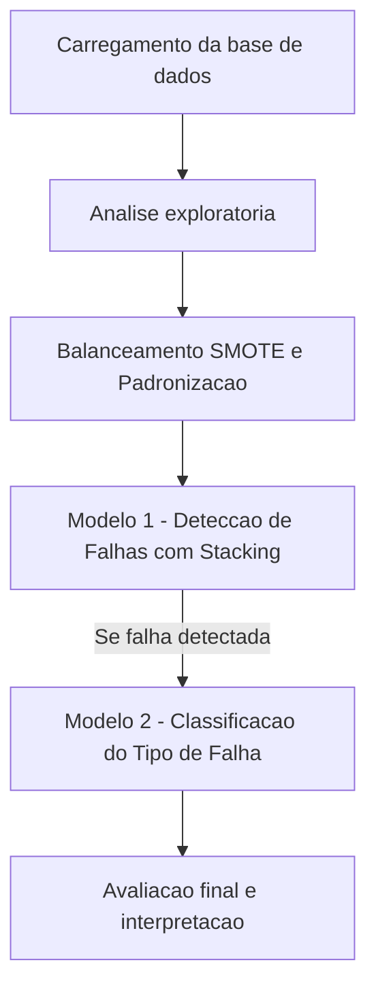

# Diagnóstico Inteligente de Falhas em Máquinas com Stacking

Este projeto tem como objetivo construir um modelo preditivo robusto para detectar falhas em máquinas industriais e, quando uma falha é detectada, classificar automaticamente o tipo específico de falha. A aplicação dessa solução pode apoiar estratégias de manutenção preditiva, aumentar a segurança operacional e reduzir custos com paradas não planejadas.

## Objetivo

Detectar com precisão se uma máquina irá falhar em breve, e se falhar, identificar o tipo de falha entre quatro categorias. O foco está em criar uma solução interpretável, confiável e com forte apelo para demonstração em portfólios técnicos profissionais.

---

## 1. Análise Exploratória e Insights

Antes da modelagem, foi conduzida uma análise exploratória com foco em:

- Distribuição das variáveis e presença de desbalanceamento
- Correlação com a variável alvo `Target`
- Verificação de vazamento de informação
- Separação entre variáveis numéricas e categóricas

**Principais descobertas:**

- O dataset original estava altamente desbalanceado (classe 0 dominante)
- Algumas variáveis foram normalizadas para melhorar a performance dos modelos
- O balanceamento com SMOTE foi aplicado **somente no conjunto de treino**

---

## 2. Pipeline de Modelagem

````mermaid

````

### Pré-processamento

- Aplicação de SMOTE somente no conjunto de treino
- Padronização com `StandardScaler` apenas nos dados de treino
- Separação entre validação e teste respeitando a proporção das classes

### Modelagem

#### Modelo 1 - Detecção de Falha (Binário)

- Algoritmos: Random Forest + XGBoost
- Meta-modelo: Regressão Logística
- Stacking com validação cruzada (CV=5)
- Ajuste de threshold para otimização de F1 e Recall

#### Modelo 2 - Classificação do Tipo de Falha (Multiclasse)

- Algoritmo: Random Forest
- Executado somente nos casos com falha detectada no modelo 1
- Classes: Heat Dissipation, Overstrain, Power Failure, Tool Wear

---

## 3. Métricas de Desempenho

### Validação (Modelo 1)

- **Accuracy:** 98%
- **Precision:** 82.9%
- **Recall:** 68.0%
- **F1 Score:** 74.7%
- **ROC AUC:** 0.991

### Teste (Modelo 1)

- **Accuracy:** 98%
- **Precision:** 68.4%
- **Recall:** 79.6%
- **F1 Score:** 73.6%
- **ROC AUC:** 0.957

> O modelo demonstrou robustez e generalização, mesmo com dados desbalanceados. Ótimo desempenho em detectar falhas com poucas ocorrências, mantendo baixo número de falsos positivos.

---

### Validação (Modelo 2)

- **Accuracy:** 91.8%
- **Precision (macro):** 94.0%
- **Recall (macro):** 92.5%
- **F1 Score (macro):** 92.8%
- **ROC AUC (macro):** 0.988

### Teste (Modelo 2)

- **Accuracy:** 84%
- **Precision (macro):** 82.9%
- **Recall (macro):** 81.3%
- **F1 Score (macro):** 81.8%
- **ROC AUC (macro):** 0.975

> O modelo apresentou ótimo desempenho mesmo com poucas amostras por classe. Todas as classes atingiram F1 acima de 0.70, com destaque para "Heat Dissipation" e "Power Failure".

---

## 4. Visualizações Geradas

- Matriz de confusão para detecção binária (falha ou não)

- Matriz de confusão para classificação multiclasse (tipo de falha)

- Análise por classe:

  - Heat Dissipation Failure: 16 acertos, 1 erro
  - Overstrain Failure: 8 acertos, 4 erros
  - Power Failure: 13 acertos, 1 erro
  - Tool Wear Failure: 5 acertos, 2 erros

- Curvas ROC 

- Relatórios de classificação completos

---

## 5. Conclusão

O pipeline completo se mostrou altamente eficaz na detecção e classificação de falhas em máquinas industriais. Com desempenho consistente em validação e teste, e estratégias sólidas de balanceamento e validação, o modelo está pronto para aplicação real em sistemas de manutenção preditiva. O uso de stacking e avaliação separada por etapas confere robustez e transparência à solução.

---

## Requisitos

As bibliotecas utilizadas estão listadas em `requirements.txt`, incluindo:

- pandas
- numpy
- matplotlib
- seaborn
- scikit-learn
- xgboost
- imbalanced-learn

---

## Execução

O notebook `Diagnóstico_inteligente_de_falhas_maquinas.ipynb` contém todas as análises, modelagens e visualizações.
Pode ser aberto diretamente em qualquer ambiente Jupyter ou Google Colab.

## Autor

**Heitor Tonet**\
Engenheiro de Controle e Automação e Cientista de Dados, com foco em manutenção preditiva industrial, especializado em modelos de RUL, detecção de falhas, séries temporais e simulações baseadas em física.

## Licença

MIT License

